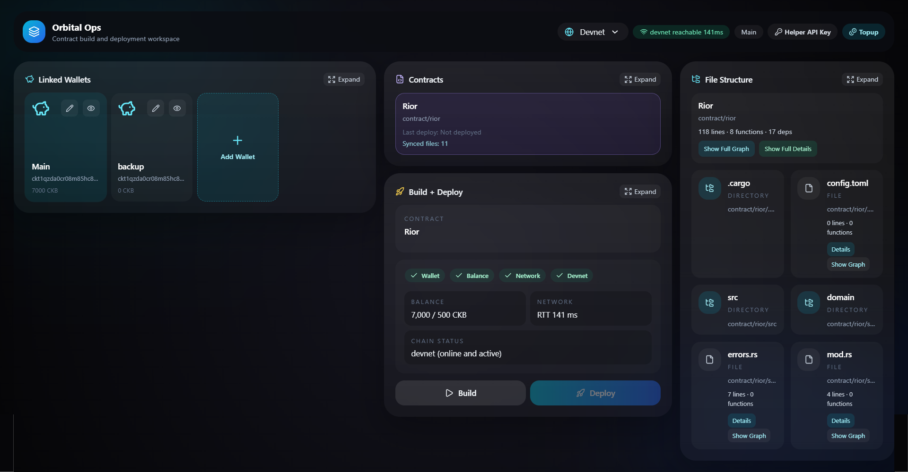
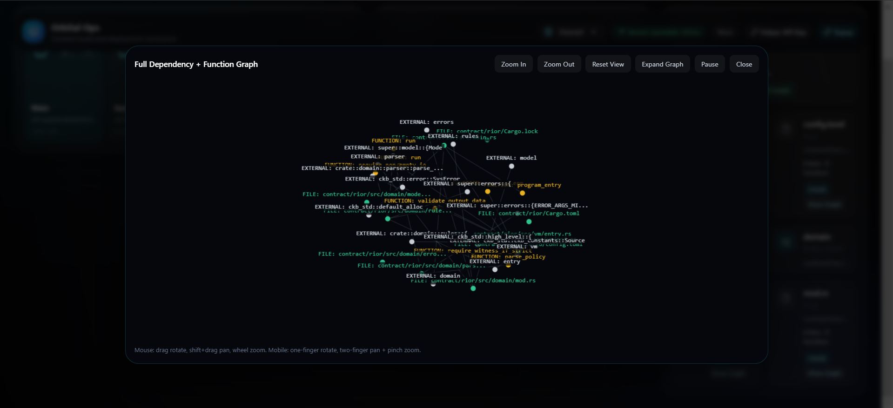

# Builder Track Weekly Report — Month 2 Week 2
> Tracking progress in the CKB Academy Builder Program

---

**Name:** Positive Vibes  
**Week Ending:** May 17, 2026  
**Track:** CKB Developer Builder  
**Status:** Month 2 Week 2 — Complete

---

## Proof

### Dashboard


### Pipeline



---


## Executive Summary

This week focused on closing the gap between simulated UI states and live backend execution in Orbital. Primary outcomes: dashboard actions now trigger real deployment pipeline steps, helper service reliably streams funding progress via SSE, and contract metadata inspection is fully wired to persisted deployment artifacts. The system now supports an end-to-end devnet workflow: configure → build → deploy → fund → observe → iterate.

---

## Builder Progress

```
Focus: Live Integration → State Consistency → Observability Hardening
```

| Status | Focus Area | Outcome |
|--------|------------|---------|
| Complete | Live Deployment Trigger | Dashboard "Deploy" action executes backend pipeline; artifacts persisted and reflected in UI |
| Complete | Funding Flow Integration | Helper service executes devnet transfers; SSE streams progress to frontend without polling |
| Complete | Contract Metadata Inspection | File structure, code hashes, and dependency graphs populated from actual deployment records |
| In Progress | Multi-Network Configuration | Devnet fully operational; testnet parameter scaffolding in place; mainnet guardrails drafted |
| In Progress | Session Security Hardening | Passkey auth stable; wallet secret exposure reduced; token rotation logic implemented |

---

## Key Learnings

### Deployment State Must Be Explicit and Versioned
> Early iterations assumed deployment success implied metadata availability. In practice, race conditions between helper execution and backend persistence caused UI inconsistencies. The solution: treat deployment artifacts as immutable, versioned records with explicit status transitions (pending → executing → confirmed → indexed). This pattern simplifies debugging and enables reliable rollback.

### SSE Requires Backpressure Awareness
> Streaming progress from helper to frontend via SSE works well for low-frequency events, but bursty build logs can overwhelm clients. Implemented chunked event batching with client-side ack tracking to maintain responsiveness without dropping critical state updates.

### CKB Script Deployment Is Metadata-Heavy
> Unlike EVM-style deployments, CKB requires tracking code hash, cell deps, and witness layout for every script. Orbital now auto-generates a deployment manifest that captures this context, making contract inspection and replay significantly more reliable.

---

## Practical Progress

### Project: Orbital
> A local-first CKB development environment for contract deployment, testing, and iteration.

```
Workflow: Configure → Build → Deploy → Fund → Observe → Iterate
```

#### Backend & Orchestration
- [x] Connected dashboard deploy action to backend pipeline; execution status streamed via SSE
- [x] Implemented deployment manifest generation: code hash, cell deps, witness template, network target
- [x] Added idempotency keys to funding requests to prevent duplicate transfers during retry
- [x] Extended GraphQL schema to expose deployment history with structured metadata
- [x] Added server-side validation for network parameters before pipeline execution

#### Helper Service
- [x] Funding executor now confirms on-chain inclusion before reporting success
- [x] SSE stream includes structured progress stages: queued → preparing → executing → confirmed
- [x] Added lightweight health check endpoint for frontend connectivity validation
- [x] Implemented graceful shutdown handling to avoid orphaned transactions during restart

#### Frontend Integration
- [x] Replaced simulated build/deploy states with live backend responses
- [x] Added deployment history view with filter by network, contract, and status
- [x] Integrated contract structure modal with actual dependency graph from deployment manifest
- [x] Added visual indicators for funding transaction status (pending/confirmed/failed)
- [x] Improved error handling: user-facing messages now map backend error codes to actionable guidance

#### Security & Configuration
- [x] Reduced wallet secret exposure: secrets now held only in helper runtime, never serialized to frontend
- [x] Implemented short-lived session tokens with automatic rotation
- [x] Added network guardrails: mainnet deployments require explicit confirmation + secondary auth
- [x] Drafted testnet configuration profile; devnet remains default for safety

---

## Blockers & Resolutions

| Blocker | Impact | Resolution |
|---------|--------|------------|
| SSE event ordering inconsistencies during rapid state changes | UI showed out-of-order progress updates | Implemented sequence numbering + client-side reordering buffer |
| Deployment manifest generation failed for contracts with complex cell deps | Metadata incomplete, breaking inspection view | Added dependency resolution step pre-deployment; validates all deps before artifact generation |
| Helper service occasionally missed funding confirmations on devnet restart | UI showed pending indefinitely | Added confirmation polling fallback with exponential backoff; helper now subscribes to node mempool events |

---

## Next Week's Focus

| Priority | Goal | Success Criteria |
|----------|------|-----------------|
| High | Testnet workflow validation | Deploy a contract to testnet using Orbital; funding and inspection functional |
| High | End-to-end integration tests | Automated test covering configure → deploy → fund → inspect cycle |
| Medium | Contract analysis enhancements | Show cyclomatic complexity, script size, and estimated execution cost in UI |
| Medium | Session recovery flow | Handle helper restarts without requiring user re-auth or manual state sync |
| Low | Documentation pass | Update Orbital README with live workflow diagrams and troubleshooting guide |

---

## Progress Summary

| Category | Completion | Notes |
|----------|------------|-------|
| Devnet Setup | 100% | Stable, reproducible |
| Contract Workspace | 95% | Manifest generation complete |
| Deployment Automation | 95% | Idempotent, network-aware |
| Backend Control Plane | 95% | GraphQL + SSE fully integrated |
| Helper Service | 100% | Funding + streaming reliable |
| Frontend Dashboard | 90% | Live states wired; minor polish pending |
| End-to-End Integration | 85% | Devnet cycle complete; testnet next |
| Security Hardening | 80% | Secrets isolated; token rotation active |

**Overall Month 2 Week 2:** Orbital now delivers a functional, observable devnet workflow with live deployment execution, real-time funding feedback, and structured contract inspection. The foundation for multi-network support is in place, and security boundaries between UI, backend, and helper are enforced. Next week targets testnet validation and automated integration testing to increase confidence ahead of broader usage.

## Repository References

- CKBuilders Repository: https://github.com/Radiiplus/ckbuilders
- Orbital Repository: https://github.com/Radiiplus/Orbital

---
*Report generated for CKB Academy Builder Track — Published to personal CKBuilder repository*


